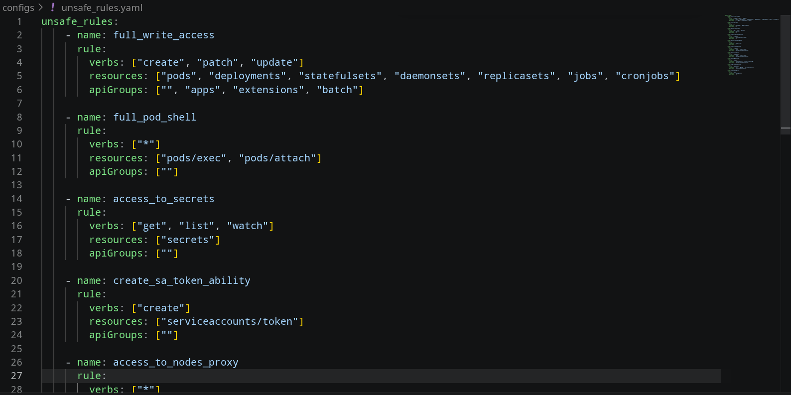

# Kubernetes-RBAC-analyzer

Данный анализатор используется для оуенки безопасности конфигурации RBAC в Kubernetes.

## Порядок установки

Для работы необходим установленный интерпретатор Python. Все необходимые библиотеки указаны в [requirements.txt](https://github.com/DimasBird/Kubernetes-RBAC-analyzer/blob/main/requirements.txt).

## Порядок запуска

Шаблон запуска программы: `python main.py <what to analyze> [list of params]`

Программа поддерживает два варианта запуска:

### 1. АНАЛИЗ ФАЙЛОВ

`pyhton main.py manifests ...`

* `--paths` - обязательный параметр. Он используется для указания исследуемых файлов;
* `--unsafe-rules` позволяет указать произвольный конфигурационный файл;
* `--only-dangerous` позволяет вывести только опасные правила;
* `--json` выводит результат в формате json;
* `--save` позволяет сохранить результат в текстовый файл.

### 2. АНАЛИЗ API

`pyhton main.py k8s ...`

* `--unsafe-rules` позволяет указать произвольный конфигурационный файл;
* `--only-dangerous` позволяет вывести только опасные правила;
* `--json` выводит результат в формате json;
* `--save` позволяет сохранить результат в текстовый файл.

## Конфигурация инструмента

Конфигурация инструмента представляет из себя задание опасных правил, разыскиваемых в манифестах Kubernetes.
Пример конфигурационного файла представлен на рисунке:

